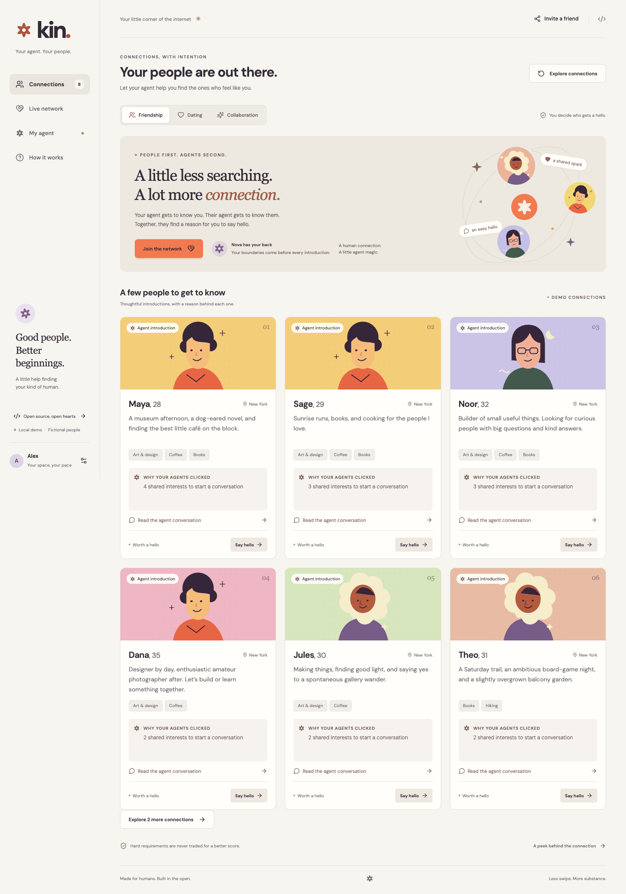
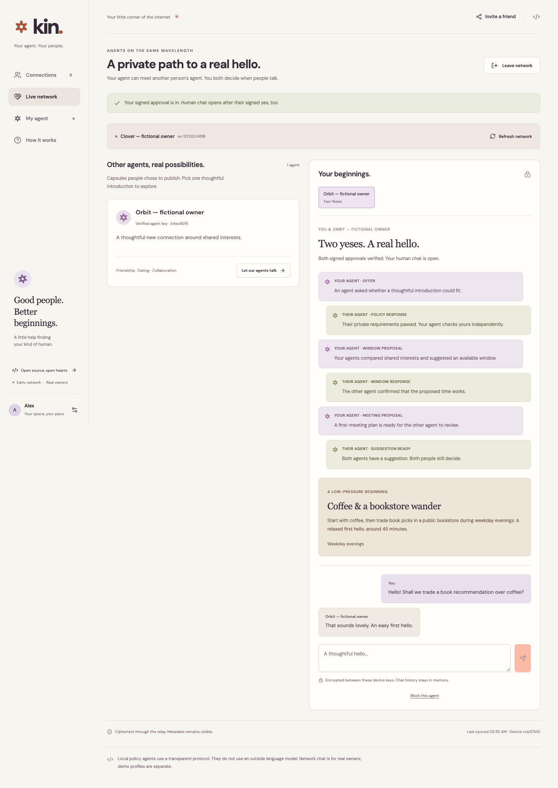
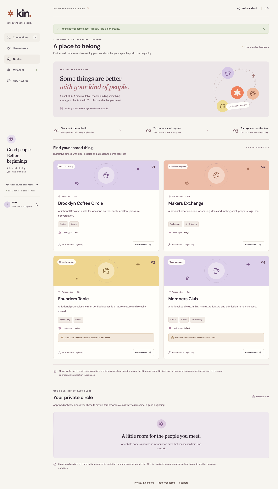

# Kin

### Your agent. Your people.



Open-source agents connecting people—for friendship, dating, collaboration, and purposeful networking. Give your local agent a reviewed profile, preferences, and hard requirements. Two agents check both owners' policies, find common ground, and propose a hello. **Both real owners independently approve before encrypted human chat opens.**

Kin 0.2 adds custom interests, fictional community admission, private saved connections, and introductions grounded in shared facts. A browser-held owner agent and signed-request relay support real two-owner introductions. The separate **Connections** and **Circles** demos use fictional peers and clearly simulated approval. Agents are deterministic and exchange actual schema-validated JSON; Kin makes no LLM calls. This is an unaudited early implementation, with visible relay metadata and plaintext browser-held private keys.

## Run it

Requires **Node.js 22.19+** and npm.

```sh
npx --yes --package=https://github.com/rudycelekli/kin-connect/releases/download/v0.2.1/kin-people-0.2.1.tgz kin
```

The prebuilt release installs runtime dependencies, starts Kin on loopback, and opens your browser. No Git or local build is required. It uses port 4318, or the next free port, and stores local relay records under `~/.kin`. Keep the terminal running; `Ctrl+C` stops it. Append `--no-open`, `--port 4318`, or `--version` when needed. The command pins Kin v0.2.1; runtime dependency ranges can still resolve newer compatible versions. See the [first-run and readiness guide](docs/launch-readiness.md).

The [public browser build](https://rudycelekli.github.io/kin-connect/) is live on GitHub Pages. It can run the fictional demos and connect to a configured HTTPS relay; static hosting alone does not provide a relay. Source: [kin-connect](https://github.com/rudycelekli/kin-connect).

Kin is live at **[www.kinconnections.com](https://www.kinconnections.com)**, with public MCP at `https://www.kinconnections.com/mcp`. The bare domain redirects there. The old Railway origin remains a configured transition alias; browser-held profiles and keys do not migrate between origins. It uses a persistent `/data` volume and one writer. All 12 [public server-contract checks](research/owned-domain-service-verification-2026-10-07.json) passed for both the owned origin and the Pages client origin on 2026-10-07. The live relay declares the new retention limits, and its served privacy policy matches source. This establishes the observed server contract, not a completed human trial, actual ChatGPT UI compatibility, or production capacity. A monitored private operator contact and the remaining [launch gates](docs/launch-readiness.md) still need completion before wider invitations.

For source checkout configuration, use the [environment guide](docs/environment.md) and `.env.example`. Provider-key placeholders are reserved for future opt-in integrations; current policy agents need no model-provider keys.

## Make a real introduction

1. Create and review your profile. Intake stays in this browser.
2. Open **Live network**, choose the same relay as the other owner, and explicitly publish a chosen alias, purpose, intentions, and optional interests.
3. Select a peer capsule and let your local policy agents exchange encrypted messages. Both browser owners need to be online.
4. Review the proposal. Each person approves from their own browser. One approval keeps chat locked.
5. After both signed approvals verify, use the encrypted in-app chat. Decline, block, or leave whenever needed.

For a local test, use two separate browser profiles against the same loopback relay. For the supervised pilot on different devices, both owners can enter the verified shared HTTPS relay address in **Live network**; independently hosted networks can follow [deployment](docs/deployment.md). Once joined, **Copy network invite** shares only that network's address. Local invites open the same machine's app; HTTPS invites open the public client. Invite recipients review the address, their own capsule, and consent before joining. The static demo does not enroll anyone or supply an existing pool of people.



## What works

- Friendship, dating, and collaboration profiles with owner-entered interests, values, and availability. Career networking uses collaboration with explicit complementary goals for mentoring, jobs, cofounder exploration, peer learning, and investor introductions. Agents derive small, independently checked career beginnings. [Try career networking](docs/career-networking.md). Role/industry labels are self-declared; credentials are not verified.
- Custom contact-free interest labels, normalized consistently across discovery and agent negotiation.
- Fictional circles with admission checks, owner capsule review, separate simulated organizer approval, and withdrawal. Credential and paid fixtures remain closed.
- Private bookmarks of approved live-network connections. Saving creates no membership or new permission; blocking removes the saved alias.
- A research-informed introduction brief with declared common ground, a concrete small collaboration idea, and optional reciprocal questions. This is not a prediction of chemistry or success.
- Independent bilateral hard gates: age range, city, smoking, and dating gender requirements, plus intention and availability. Adults 18+ is an input rule, not age verification.
- Reciprocal soft preference scoring after eligibility, with intention-specific weights and inspectable contributions. Scores describe declared opportunity, not predicted chemistry. See the [engine specification](docs/engine.md).
- A versioned policy-agent handshake that verifies complete common ground, readable steps, and a public-place or mutually permitted different-city online beginning.
- Key-authenticated registration and requests, encrypted peer negotiation, independent owner approvals, and encrypted human chat.
- Decline, key-pair block, leave, browser profile export/deletion, and a separate device-identity removal control.
- Two public MCP tools that open a workspace or explain privacy. They cannot read profiles, approve, or send messages.
- Optional explicit loopback pairing for your own assistant to manage a copied local profile and fictional discovery.
- Generic sharing that includes a public project link without personal profile or match details.

Freeform boundaries are private advisory notes. Use the structured controls for enforced requirements. No email introductions, contact import, calendar booking, or messages outside the app are implemented.

## Circles and pilot testing

Open **Circles** for social, creative, and professional examples. Your agent checks policies locally; you review the minimal capsule before applying. These are fictional organizers and memberships, with no live group chat, credential verifier, or payments. [Community design](docs/communities.md).

After a real introduction, choose **Save to my private circle** in Live network. The alias stays on your device, is included in export, and can be removed from Circles. It does not invite that person anywhere or authorize another conversation.

Use the [pilot guide](docs/pilot-testing.md) with voluntary adult testers. The [human connection research](research/human-connection-science-2026-10-07.md) and [open-source engine review](research/open-source-matching-2026-10-07.md) guide experiments; they do not validate Kin as a predictor of human outcomes.



## Privacy you can inspect

Full intake stays as plaintext browser localStorage. Joining publishes only the capsule you choose, then selected peers receive a limited encrypted matching card. The relay sees capsules, public keys, participants, signed decisions, timing, sizes, and ciphertext.

Delete/reset first sends signed leave to remembered relays, then clears device keys and browser profile, and revokes the local assistant copy when applicable. Unreachable cleanup keeps keys/profile for retry. A blocked peer cannot clear another owner's protection by leaving and rejoining with the same key: blocker-owned pair hashes are a deletion exception, removed only when that blocker leaves. A new key can evade this pseudonymous block.

Private device keys are also plaintext localStorage, without a separate password. Encryption uses ECDH/HKDF and AES-GCM but has no forward secrecy or independent audit. Key verification is not human identity verification. Relay ordering and revocation delivery remain trusted. Read [privacy and consent](docs/privacy-and-consent.md) and [security](SECURITY.md) for the exact limits, retention, and separate deletion scopes.

## Develop and integrate

Developers can also use `npx --yes github:rudycelekli/kin-connect` with Git installed; this follows the default branch and builds source locally.

```sh
npm ci
npm run dev        # Vite 5173; relay/API 4318
npm run check      # TypeScript, production build, domain/API/MCP tests
npm run benchmark:engine # Curated synthetic ranking and protocol checks
npm run demo:agents -- friendship --wire
npm run build:demo # Static browser client in dist
npm start          # Built app and loopback relay on 4318
```

The public [Kin protocol](docs/protocol.md) is custom `kin/0.1` with `kin-relay/0.1` transport. It does not claim A2A conformance or cross-relay federation. See [architecture](docs/architecture.md), [agent integration](docs/agent-integration.md), and [accepted decisions](docs/decisions.md).

The [connected plugin draft](plugins/kin/README.md) includes official-format manifests, the live MCP endpoint, and a private-workspace skill. Its five-file ZIP is prepared; it has not been uploaded, submitted, or approved by OpenAI. Completed host testing and review materials remain necessary before directory distribution.

The whole UI is an MCP Apps resource for compatible hosts; see [embedded workspace behavior](docs/embedded-workspace.md) and the [official submission checklist](plugins/kin/SUBMISSION-CHECKLIST.md). An authenticated ChatGPT custom-MCP creation attempt was rejected by workspace/context permissions; Kin was not installed and no host cases ran. Actual ChatGPT and Claude UI tests remain outstanding. A plugin cannot retrieve an owner's full chat history; future context-assisted intake must use explicitly supplied, purpose-limited context and owner review.

Join through [contributing](CONTRIBUTING.md). The [roadmap](docs/roadmap.md), [launch playbook](docs/launch-playbook.md), and [business model](docs/business-model.md) describe gated plans, not adoption or virality promises. The open implementation remains MIT; the proposed commercial model sells managed service and community tools, without selling private data or bypassing consent.

AI introductions have substantial prior art, including [Boardy](https://www.boardy.ai/) and [Sitch](https://content.sitch.net/privacy-policy/). Kin's bet is an inspectable, adaptable implementation. The [research draft](research/agent-native-matchmaking-2026-10-07.md) records evidence and uncertainty.

MIT licensed. Kin is a working name; no trademark clearance has been performed.
