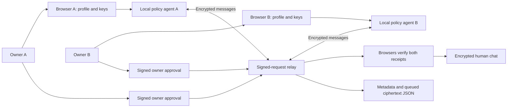

# Architecture

Kin combines a React/TypeScript owner workspace, a deterministic `matchmaking` bounded context, and an authenticated ciphertext relay. Fictional demo and real network share policy/message schemas but use separate consent mechanisms.

The `communities` bounded context evaluates fictional circle admission and local application states. Its infrastructure supplies a frozen catalog; its public domain/application API exposes no live organizer, group-chat, credential, or billing authority. Applications bind to owner/circle policy change detectors and require owner approval plus separately simulated organizer approval. Unsupported credential and payment gates fail closed.

## Policy domain

`src/matchmaking/domain` owns profiles, bilateral eligibility, preference scoring, first-meeting plans, and `LocalPolicyAgent`. `application` coordinates discovery; `infrastructure` supplies fictional peers. Public exports live in `src/matchmaking/index.ts`; UI types in `src/shared/types.ts` and network envelopes in `src/shared/network-types.ts`.

Each agent retains private requirements and independently checks them before preferences. Age, city, smoking, dating gender requirements, intention, availability, and pause gates remain authoritative. A score describes overlap, never permission. Freeform notes are advisory. Actual serialized JSON passes strict schema validation and conversation-stage checks; agents check proposed overlap and meeting facts. Built-in dialogue is deterministic, with no LLM.

## Browser workspace

Every app build uses `src/static-demo.ts` for intake and fictional matching. Plaintext `kin-local-demo-v1` localStorage contains profile, demo proposals, approvals, and blocks. The fictional **Connections** view simulates peer approval, labels it, and makes no remote profile request.

The same storage contains circle applications and allowlisted saved-connection bookmarks. Profile changes clear applications; loading filters invalid/stale applications without discarding a valid profile. Bookmarks grant no network permission and are included in export/deletion. Saving from Live network verifies both signed approvals; blocking removes the saved alias. Embedded export offers selectable owner-only text without uploading it or placing it in model context.

`createIntroductionBrief` uses only validated negotiated interests, values, purpose, and meeting availability. It proposes optional questions and a small next step. Its six research/design rules are versioned in `knowledge/connection-principles.json`; these hypotheses do not calibrate the ranking score or predict outcomes. `prompts/connection-coach.md` defines a future model adapter's boundaries; no model adapter is active.

`src/network/NetworkPanel.tsx` implements the separate **Live network**: opt-in public capsules, peer negotiation, and each owner's signed decision. `crypto.ts` generates device keys, verifies registration and approval proofs, derives conversation keys, and encrypts messages. `relay-client.ts` obtains one-use challenges and signs requests. Private JWKs persist in plaintext browser storage; active negotiations, key pins, and human chat history stay in memory.

Profile changes deactivate the network agent and request signed leave. Rejoin after cleanup to apply the new policy. Failed cleanup keeps keys for retry. Reset signs leave against remembered relays before clearing local keys. Real network has no simulated approval; both owners' browsers participate in negotiation. The relay does not host agents for offline owners.

The active runtime records local declines, blocked peers, and pending revocations before awaiting a request. Inbox merging preserves these terminal states. A final guard after challenge acquisition and signing prevents a locally revoked message, readiness signal, or approval from being dispatched. An uncertain revocation keeps the thread closed with Retry or Leave controls; remote delivery still depends on the relay.

## Relay and consent

`server/network.ts` authenticates ECDSA P-256 key possession with two-minute one-use challenges. Signed text binds route, challenge ID, nonce, and payload. The router validates keys and participation, bounds requests, and limits rates and capacity.

Registration proofs bind capsule and exchange key to signing identity. Owner decision receipts bind a conversation and both client-generated registration epochs. Re-registering clears old active negotiation and approval state. The relay accepts human packets only after both agents are ready and both owners approve. Browsers independently verify both approval signatures. Ordering, availability, and revocation delivery still depend on the relay.

One atomic JSON file stores public capsules, conversation metadata, signed decisions, and ciphertext. Acknowledgment, decline, block, and leave purge relevant packets. Leave removes the identity and involving conversations; a blocker-owned pair hash remains when the blocked peer leaves. Writes flush the temporary file and atomically replace the document; POSIX also fsyncs the containing directory before acknowledgment. Windows lacks the portable directory-fsync step. These request filesystem durability, not proof of behavior during power loss or controller failure. There is no automatic expiry or distributed persistence.

## MCP surfaces

`server/chatgpt.ts` exposes `kin_open_connections` and `kin_explain_privacy`. Its MCP Apps resource opens a browser workspace; model tools cannot read profiles, approve, or send messages. The portable plugin draft is under `plugins/kin`.

The stdio adapter in `server/mcp.ts` serves an explicitly paired local owner assistant. It manages the copied loopback profile and fictional discovery through a scoped 24-hour bearer. It cannot approve. Public relay deployments disable the plaintext owner API.

## Extension boundaries

Custom negotiation is `kin/0.1`; relay transport is `kin-relay/0.1`. Neither claims A2A conformance or cross-relay federation. Optional model-assisted intake needs provider disclosure and owner review. Future adapters must preserve enforcement and consent, publish interoperability tests, and provide versioned revocation semantics.

See [protocol](protocol.md), [privacy](privacy-and-consent.md), [capacity and business plan](business-model.md), and [decisions](decisions.md).
