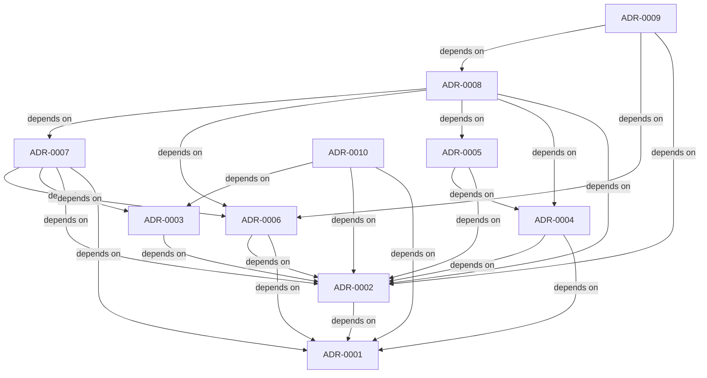

# Architecture decisions

Accepted decisions describe the fictional reference, optional local integrations, and separate real owner network. Rebuild this index with `node scripts/adr-index.mjs`; verify it with `node scripts/adr-index.mjs --check`.

This index and [its JSON graph](adr-index.json) are stored on disk. Ruflo AgentDB persistence is separate and is not claimed by this script.

| Decision | Title | Status | Date |
| --- | --- | --- | --- |
| [ADR-0001](../docs/adr/0001-local-policy-agent-reference.md) | Local policy-agent reference with a matchmaking bounded context | Accepted | 2026-10-07 |
| [ADR-0002](../docs/adr/0002-human-owned-introduction-consent.md) | Human-owned introduction consent and invalidation | Accepted | 2026-10-07 |
| [ADR-0003](../docs/adr/0003-custom-versioned-negotiation-flow.md) | Custom versioned Kin negotiation flow without A2A conformance claims | Accepted | 2026-10-07 |
| [ADR-0004](../docs/adr/0004-loopback-session-storage.md) | Loopback-only session storage with export and deletion | Accepted | 2026-10-07 |
| [ADR-0005](../docs/adr/0005-scoped-owner-assistant-pairing.md) | Scoped owner-assistant MCP pairing without approval authority | Accepted | 2026-10-07 |
| [ADR-0006](../docs/adr/0006-browser-only-fictional-demo.md) | Browser-only fictional demo using the shared domain | Accepted | 2026-10-07 |
| [ADR-0007](../docs/adr/0007-real-owner-encrypted-network.md) | Real owner network with browser-held keys and signed consent | Accepted | 2026-10-07 |
| [ADR-0008](../docs/adr/0008-fresh-consent-and-durable-storage.md) | Fresh owner consent, durable state, and persistent blocks | Accepted | 2026-10-07 |
| [ADR-0009](../docs/adr/0009-community-admission.md) | Fictional circle admission with explicit owner and simulated organizer consent | Accepted | 2026-10-07 |
| [ADR-0010](../docs/adr/0010-research-informed-introductions.md) | Research-informed introduction guidance without outcome prediction | Accepted | 2026-10-07 |

